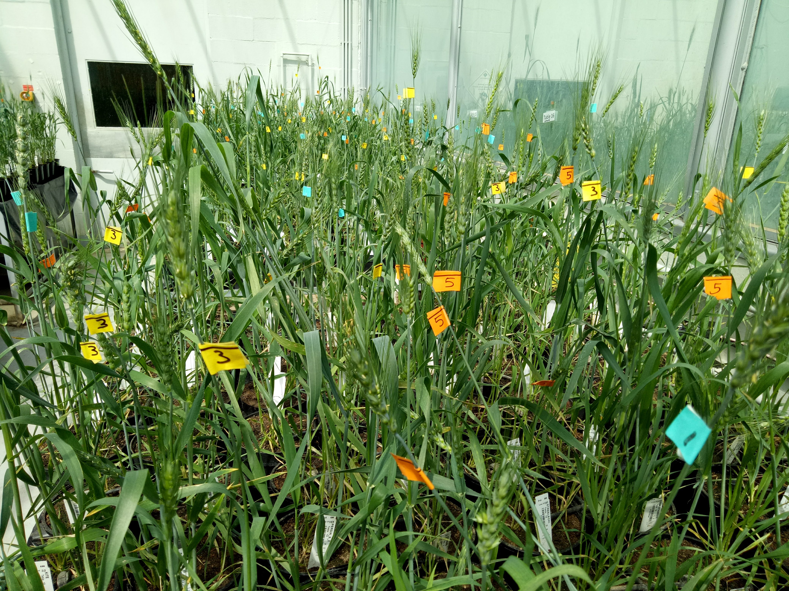

```{r setup, include=FALSE}
knitr::opts_chunk$set(
  results = 'asis',
  echo = FALSE,
  warning = FALSE,
  message = FALSE,
  fig.align = 'center'
)

#Load libraries
library(tidyverse)
library(gapminder)
library(kableExtra)
```


# Introduction
I joined CSIRO over twenty years ago and have worked on many different projects mostly in wheat and barley. I love working in the laboratory combined with field and glasshouse work. My work involves varied aspects of seed biology, including seed dormancy, seed composition and environmental stresses. Before data school I would enter data either in FieldPrime or Excel and all my data analyses and visualisation was done in Excel. I had no experience writing code at all.


# My Project
This project analyses the effect of high temperatures during the grainfill stages of wheat plants. We grew 230 different wheat varieties selected from the OzWheat panel and 10 landlines that were used in previous experiments. We have phenotypic and genetic data for all lines from other trials.
Plants were grown under regular glasshouse conditions, scored for flowering date, and at a set developmental stage exposed to a hot spell of 7 days. At plant maturity (node collapse) heads were harvested and the germination of seeds was scored for each plant. Seeds were scanned to measure different parameters of seed size.
We want to find genotypes that are most sensitive and most insensitive to the heat treatment and determine the genetic basis of heat response to future proof Australian wheat varieties.

{width=350px}

{ width=25%}


```{r reading dataframe}
df <- read_csv("data/heat_combined.csv")
df1 <- df %>% mutate_if(is.numeric, round, digits=1)
```


## Preliminary results

```{r mytable, out.width='100%', echo = FALSE}
knitr::kable(head(df1, n = 5), format = "html", caption = "Preview of some of the data") %>% 
  kable_styling("striped")
```

**Plots from R**
```{r plot1, out.width='60%', fig.align='center', fig.height= 4, fig.width=6, fig.cap="Seed size heat-treated vs control"}
df %>% 
  group_by(trt) %>% 
    ggplot()+
  geom_density(aes(area_mm2, colour = trt))+
  labs(x = "Seed size (area in mm2)", 
       y = "density",
       colour = "Treatment")+ 
  theme(plot.title = element_text(size = 15, face = "bold"))
```

```{r plot2, out.width='60%', fig.align='center', fig.height= 4, fig.width=6, fig.cap="Seed size heat-treated vs control "}
df %>%  na.omit(df) %>% 
  group_by(trt) %>% 
  ggplot(aes(minellipse_mm, majellipse_mm, colour = (trt)))+
  geom_point(alpha =0.5)+
  geom_smooth(method = "lm")+
  labs(x = "Average seed width (mm)", 
       y = "Average seed length (mm)",
       colour = "Treatment")+ 
  theme(plot.title = element_text(size = 15, face = "bold"))


```

```{r plot3, out.width='60%', fig.align='center', fig.height= 4, fig.width=6, fig.cap="Germination density plot"}
df %>% na.omit(df) %>% 
  group_by(trt) %>% 
  ggplot+
  geom_density(aes(germination, colour = trt))+
  labs(x = "Germination %", 
       y = "density",
       colour = "Treatment")+ 
  theme(plot.title = element_text(size = 15, face = "bold"))

```


# My Digital Toolbox

I used Tidyverse to combine data from many seperate data files into 1 'tidy' tibble! I spent a lot of time with ggplot2 looking at the data, finding outliers, trends etc. All of R was totally new to me.

# Favourite tool

I really like the ggplot package, looking at data in many different ways gives a much better insight into what might be going on. What a difference from bar graphs in Excel. Also of course the tidyverse package, what would we do without it?


{width=100px}
{.pull-left width=100px}


# My time went ...

Most of my time went into cleaning and tidying up data, combining data from many files into one file that I and others can succesfully use now and in the future. Many challenges had to be overcome along the way. With no coding experience at all a lot of time went into trying to remember particular terminology.

# Next steps

Next I want to link the results from the heat experiment to all the genetic data we have for the OzWheat lines. I will need to further my knowledge of the particular packages neccesary to achieve that.

# My Data School Experience

Taking time to do Data school is the best thing that happened to me for a while, especially with the timing of it all. Other than giving me a start in learning to code and using R, it has been wonderfull to work on improving data skills whilst having to work from home in Covid-19 times. I really enjoyed learning to use ggplot and seeing all the different options of visualisation of the data. I am very impressed with people in the Data School COmmunity, their willingness to share knowledge, take time for new students to learn and support them. I am looking forward to using new skills in my day to day work.


